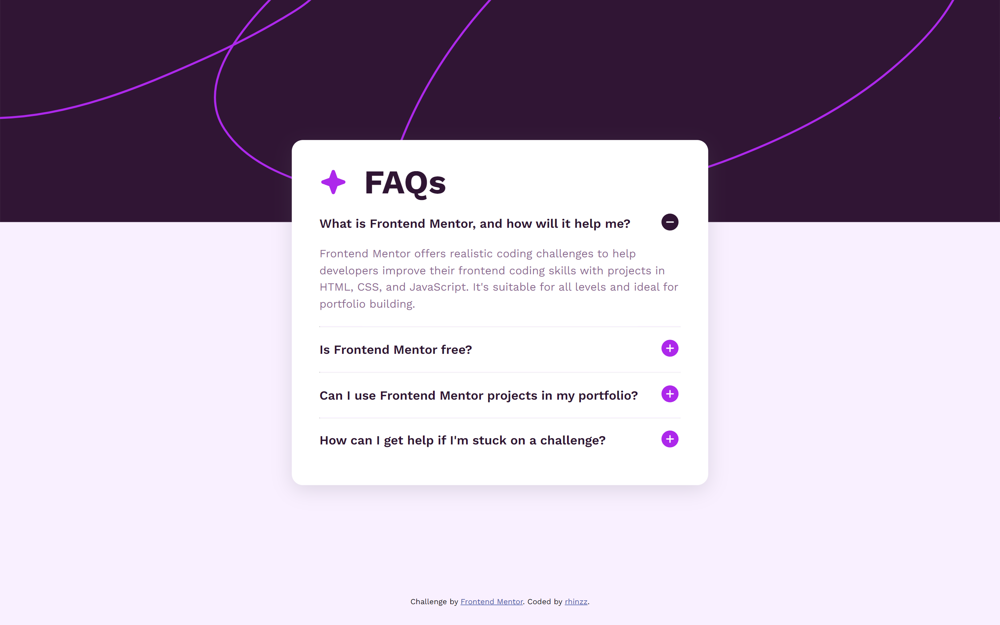

# Frontend Mentor - FAQ accordion solution

This is a solution to the [FAQ accordion challenge on Frontend Mentor](https://www.frontendmentor.io/challenges/faq-accordion-wyfFdeBwBz). Frontend Mentor challenges help you improve your coding skills by building realistic projects. 

## Table of contents

- [Overview](#overview)
  - [The challenge](#the-challenge)
  - [Screenshot](#screenshot)
  - [Links](#links)
- [My process](#my-process)
  - [Built with](#built-with)
  - [What I learned](#what-i-learned)
  - [Useful resources](#useful-resources)
- [Author](#author)

## Overview

### The challenge

Users should be able to:

- Hide/Show the answer to a question when the question is clicked
- Navigate the questions and hide/show answers using keyboard navigation alone
- View the optimal layout for the interface depending on their device's screen size
- See hover and focus states for all interactive elements on the page

### Screenshot

## My process

### Links

- Solution URL: [faq-accordion](https://rhinzz.github.io/faq-accordion/)

### Built with

- Semantic HTML5 markup
- SASS
- Flexbox
- Vanilla Javascript

### What I learned

In this challenge, I've learned accordion, one of the most component in a webpage, using HTML, SASS CSS, and, Vanilla Javascript.

### Useful resources

- [W3Schools](https://www.w3schools.com/) - This helped me for learning HTML and CSS basics. I really liked this pattern and will use it going forward.
- [Youtube](https://www.youtube.com) - This helped me with useful guides to sped up the building process

## Author

- Frontend Mentor - [@rhinzz](https://www.frontendmentor.io/profile/rhinzz)
